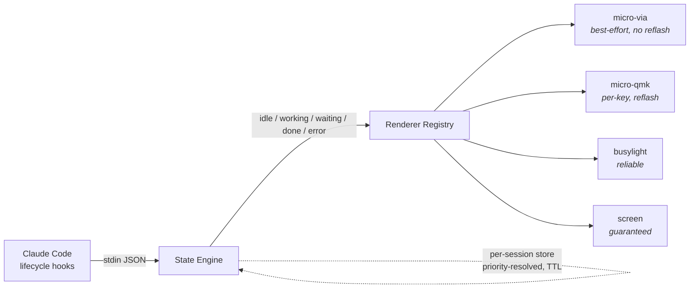

<div align="center">

# ⌨️💡 FreeMicro

### Turn any macro pad into a live status light for **Claude Code** — and any coding agent.

Drive the **OpenAI Codex Micro's Agent-Key LEDs** from your agent's *real* state — no ChatGPT desktop app. Or fall back to any VIA/QMK RGB pad, a USB busylight, or your screen. The alert **always** lands.

[](LICENSE)
[](https://www.python.org/)
[](pyproject.toml)
[](CONTRIBUTING.md)
[-orange.svg)](SPEC.md)

```
  ○ idle      ◍ working…     ◐ needs you     ● done      ✖ error
 slate         blue            amber          green        red
```

</div>

---

## Why this exists

OpenAI's **Codex Micro** has six gorgeous top-row **Agent Keys** that glow with your agent's live state — idle, thinking, done, needs-input, error. There's a catch: **that glow is pushed by the ChatGPT desktop app and only follows Codex.** Live in the terminal with Claude Code, and those keys sit dark.

FreeMicro closes the gap. It reads **Claude Code's own lifecycle hooks**, normalizes them into five states, and drives whatever light you've got — the Micro's LEDs if the pad lets us, or a guaranteed fallback if it doesn't. Glance at your desk, know if your agent is thinking or waiting on *you*. No polling a terminal you're not looking at.

> **It's not just the Micro.** FreeMicro is a small, four-layer pipeline: *agent hooks → state engine → renderer registry → hardware*. Any agent in, any RGB surface out.

## ⚠️ Honest status (read before you get excited)

FreeMicro is **pre-hardware**. The **state engine, renderer registry, screen + busylight renderers, detector, CLI, and 40 passing tests ship and work today** — the full hook → state → light loop runs right now (drive it with `freemicro demo`). What is **not yet verified** is the headline: whether the *shipping* Codex Micro exposes a writable channel so we can drive the *Agent Keys themselves*.

That is the one open question the whole LED path hinges on, and launch coverage **contradicts itself** on it (see [`SPEC.md` §4](SPEC.md)). It gets answered the moment a physical unit is probed with `freemicro detect` — not before. Until then, the `micro-via` / `micro-qmk` renderers are **experimental**, and the **screen/busylight fallback carries the signal no matter what.** We'd rather ship an honest fallback than a promise we can't keep.

## Quickstart (about 60 seconds)

```sh
# 1. Install (core is pure-Python, zero dependencies)
pip install freemicro            # or: pipx install freemicro

# 2. Wire FreeMicro into Claude Code's hooks (idempotent, non-destructive)
freemicro install

# 3. In a spare pane / on your second monitor, run the light
freemicro watch
```

Now use Claude Code as normal. The status flips to **blue** while it works, **amber** when it needs your approval, **green** when it's done, **red** on error. Try the whole pipeline without the agent or any hardware:

```sh
freemicro demo               # play idle→working→waiting→done→error on the real renderer
freemicro render waiting     # flash a single state to whatever renderer is best
freemicro renderers          # see what's available on your machine
freemicro status             # what all your sessions resolve to right now
```

No Codex Micro? No problem — it drives a [busylight](https://github.com/JnyJny/busylight) or an always-on-top screen chip instead.

## How it works



**Four decoupled layers** ([full spec](SPEC.md)):

1. **State engine** — hooks → five normalized states. Multiple agents running? A priority rule (`waiting > error > done > working > idle`) surfaces the one that needs *you*. Crashed session? A TTL drops it so the light never gets stuck.
2. **Renderer registry** — auto-selects the best available target. The **screen renderer is always kept as a fallback** — the load-bearing guarantee of the project: *the alert never depends on the pad.*
3. **Input layer** — a recommended terminal Claude Code layout ([`presets/`](presets/)) for Work Louder Input, plus a VIA-importable definition.
4. **Detector** — a read-only HID probe that answers the hardware questions and feeds a crowdsourced capability database.

## Renderers

| Renderer | What it drives | Reflash? | Status |
|---|---|---|---|
| `screen` | Always-on-top chip; ANSI console fallback | No | ✅ **Guaranteed** — always available |
| `busylight` | blink(1), Luxafor, BlinkStick, MuteMe… via [`busylight-core`](https://github.com/JnyJny/busylight) | No | ✅ **Reliable** |
| `micro-via` | A VIA/QMK pad's LEDs over raw HID (likely global colour) | No | 🧪 **Experimental** — pending M0 |
| `micro-qmk` | Per-key Agent-Key colours via custom firmware | Yes | 🧪 **Experimental** — M3 |

## How FreeMicro compares

| | **FreeMicro** | OpenMicro | VibeSignal | codex-micro.com |
|---|---|---|---|---|
| Drives the **real Codex Micro** | 🎯 goal (M1) | ❌ gamepad only | ❌ | ✅ (clone pad) |
| Works with **Claude Code** | ✅ | ✅ | ✅ | ✅ |
| **Open source** | ✅ MIT | ✅ MIT | ✅ | ❌ paid |
| Input device class | keyboard-class pad | HID gamepad | n/a | macro pad |
| Guaranteed fallback if pad is locked | ✅ screen/busylight | partial | ✅ | — |
| Crowdsourced hardware DB | ✅ | ❌ | ❌ | ❌ |

FreeMicro's niche: **macro pads as agent-status surfaces, open and on the actual hardware.** OpenMicro owns gamepads; VibeSignal owns commercial busylights; nobody has openly owned the keyboard-class pad.

## The detection spike (Milestone 0)

The single most useful thing you can do with a Codex Micro on your desk:

```sh
pip install "freemicro[detect]"
freemicro detect            # human-readable
freemicro detect --json     # paste this into a Hardware Report issue
```

It's **read-only** — it enumerates HID interfaces, flags a `0xFF60` writable channel, and prints VID/PID. Publishing that report is a genuine community first. Results feed [`hardware/capabilities.json`](hardware/capabilities.json).

Then, the active write-test — the moment-of-truth for whether we can actually light the Agent Keys:

```sh
freemicro verify-leds        # drives the pad's LEDs and records a verdict
```

It cycles the LEDs through every state so you can watch the top row, asks whether they moved (per-key or global, app-quit needed?), and saves a report you can attach to a Hardware Report issue. Purely the documented VIA/QMK path — no firmware, no proprietary protocol.

**How we plan to actually drive the LEDs** — three ranked paths (VIA raw-HID with no reflash, sniff-and-replay the app's protocol, or reflash the open-source QMK firmware), with effort/risk/reversibility for each, are worked out in **[`docs/LED-STRATEGY.md`](docs/LED-STRATEGY.md)**. Short version: the chassis is an open, VIA-capable, RP2040-based Work Louder Creator Micro 2, so the *hardware* supports every path — only the Codex firmware profile's lockdown is unverified.

## Roadmap

- [x] **M0 groundwork** — state engine, renderers, detector, write-test harness, CLI, tests
- [ ] **M0 spike** — probe the physical pad (`detect` + `verify-leds`), publish the capability report
- [ ] **M1** — finish the LED write for whatever path the pad supports
- [ ] **M2** — ship the input layout (Work Louder Input + VIA)
- [ ] **M3** — generalize to any agent × any VIA/QMK RGB pad; optional QMK keymap
- [ ] **M4** — polish, docs, grow the capability DB

## Contributing

FreeMicro gets better with every pad people test. The highest-value contribution right now needs **no code**: run `freemicro detect --json` on your hardware and [open a Hardware Report](.github/ISSUE_TEMPLATE/hardware_report.yml). See [`CONTRIBUTING.md`](CONTRIBUTING.md).

```sh
git clone https://github.com/eliBenven/freemicro && cd freemicro
pip install -e ".[dev,all]"
pytest            # 40 tests, runs in well under a second
```

## License

[MIT](LICENSE). *FreeMicro is an independent open-source project. "Codex", "Codex Micro", and "OpenAI" are trademarks of OpenAI; "Work Louder" and "Creator Micro" are trademarks of Work Louder. FreeMicro is not affiliated with or endorsed by either — the names are used nominatively to describe compatibility.*
