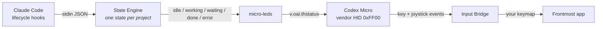

<div align="center">

# ⌨️💡 FreeMicro

### Your **Codex Micro** shows which of your **Claude Code** projects needs you, and pressing a key takes you to it.

Six Agent Keys, six repos, one key each. Blue while that project's agent is
thinking, amber when it is blocked on you, green when it finishes. Press the key
that is lit and its terminal comes to the front.

[](LICENSE)
[](https://www.python.org/)
[](pyproject.toml)
[](CONTRIBUTING.md)
[](docs/PROTOCOL.md)
[](docs/PROTOCOL.md)
[](#honest-status)

```
  ○ idle      ◍ working…     ◐ needs you     ● done      ✖ error
 #FFFFFF       #304FFE        #FF6D00        #00FF4C     #FF0033
```

</div>

---

## What it looks like in a day

Three projects open, one pad. This is a real trace of what the slot resolver
produces, not an illustration:

| Moment | AG00 | AG01 | AG02 |
|---|---|---|---|
| Start work in `api` | `api` blue | dark | dark |
| Open `web`, start a task | `api` blue | `web` blue | dark |
| Open `docs` | `api` blue | `web` blue | `docs` blue |
| `api` asks for permission | **`api` amber** | `web` blue | `docs` blue |
| You press AG00 | *api's terminal tab comes to the front* | | |
| `web` finishes | `api` amber | **`web` green** | `docs` blue |
| 3 min later, unread green decays | `api` amber | `web` white | `docs` blue |
| You close `docs`'s terminal | `api` amber | `web` white | dark |

**Nothing ever moves.** `api` was the first project you touched, so it is `AG00`
for the rest of the day, however the activity order shifts around it. The pad
becomes muscle memory, and an unlit key means "no project here" rather than
"dim", so the number of glowing keys is the number of live projects, countable
without reading anything.

A key is bound to a **project directory**, never a session id. Directories
survive `/clear`, a crashed tab, a reboot and a closed lid; session UUIDs do
not, and a pad you have to keep re-teaching is worse than no pad.

**Full design, including the slot-stability rule and the exact colours:
[`docs/AGENT-KEYS.md`](docs/AGENT-KEYS.md).**

## Why this exists

OpenAI's **Codex Micro** has six gorgeous top-row **Agent Keys** that glow with
your agent's live state. There is a catch: **that glow is pushed by the ChatGPT
desktop app, and only for Codex.** Live in the terminal with Claude Code and the
keys sit dark. Worse, the pad's keys do not emit ordinary scancodes at all, so
without that app they do not type anything either. Out of the box, with any
other agent, it is an expensive paperweight.

FreeMicro takes the pad back. It speaks the device's own vendor protocol
directly, so it can **read every key press** and **drive every LED**, wired to
Claude Code's real lifecycle hooks, with no vendor app in the loop.

The protocol is written up in **[`docs/PROTOCOL.md`](docs/PROTOCOL.md)**, as far
as we know the first public documentation of it anywhere.

## Quickstart

Two commands. The second one asks before it changes anything and tells you
exactly what to click.

```sh
pipx install git+https://github.com/eliBenven/freemicro    # not on PyPI yet
freemicro start
```

`freemicro start` walks the whole setup in order: it checks both macOS
permissions and offers to open the right System Settings pane for each, finds
your pad (USB or Bluetooth), warns you if the ChatGPT app is contending for the
same LEDs, writes your config, asks whether to drive the LEDs (default **no**),
offers to install Claude Code's hooks and then **proves they work** by firing a
synthetic session through them, offers to install the background daemon, and
finishes by lighting the pad through every state so you can see it. It is safe
to re-run whenever something has drifted, and every prompt has a default, so
`freemicro start --yes` is fine in a script.

Then the two things worth knowing about on day one:

```sh
freemicro config --web      # the visual editor: click a key on a picture of your pad
freemicro menubar           # a status item that tells you when FreeMicro has stopped working
freemicro lights --enable   # let FreeMicro drive the LEDs (off until you say so)
```

**Use `pipx`.** It puts FreeMicro in its own virtualenv with the binary on your
`PATH`, which is what both the Claude Code hooks and the background daemon need,
and it installs under `~/.local`, not somewhere macOS blocks background
processes from reading. `pip install --user` works too. If you do not have
`pipx`: `brew install pipx && pipx ensurepath`.

<details>
<summary>Prefer a clone (contributing, or reading the code)?</summary>

```sh
git clone https://github.com/eliBenven/freemicro
cd freemicro
python3 -m venv .venv
./.venv/bin/python -m pip install --upgrade pip     # editable installs need pip >= 21.3
./.venv/bin/python -m pip install -e .
export PATH="$PWD/.venv/bin:$PATH"                  # add to ~/.zshrc to make it stick
freemicro --version
```

**Do not put the clone in `~/Desktop`, `~/Documents` or `~/Downloads`.** macOS
refuses background agents access to those folders, so the daemon dies before
Python finishes starting. `freemicro daemon install` detects this and says so,
but it is easier to avoid.
</details>

Rather do it by hand? Every step `start` performs is its own command:

```sh
freemicro doctor        # every permission, the pad, and a real round-trip write
freemicro install       # wire FreeMicro into Claude Code's hooks
freemicro selftest      # prove the hook → state → LED loop, no agent needed
freemicro run           # keys in, agent state out. No flags needed.
```

`freemicro run` never needs a flag and never crashes: it starts before the pad is
plugged in, reconnects on its own when the pad drops, and prints every state
change to the terminal as it happens so you can see the loop working with the
pad unplugged.

## The visual editor

```sh
freemicro config --web
```

A local page that draws your pad. Click the key you want to change, say what it
should do in plain outcomes rather than in FreeMicro's vocabulary, and pick the
keycap that is actually fitted. If the pad is plugged in, the colour you choose
appears **on the hardware** while you drag the slider.

Standard library only: no Electron, no npm, no build step, nothing left running.
It binds `127.0.0.1` on a random port behind a per-run token, and refuses to bind
anything else. **[`docs/WEB-UI.md`](docs/WEB-UI.md)**

## The menu bar item

```sh
freemicro menubar
```

The pad is ambient, so the thing that reports on it is ambient too: a status item
in the corner showing the resolved state, the transport, the battery, which
process owns the pad, and, only when something is wrong, a clickable row that
lands you on the fix.

This is the surface that tells you FreeMicro has **stopped** working. A revoked
permission, a dead daemon or a pad that dropped for good all look exactly like
"nothing needs you" on an unlit pad, and a status display you have stopped
believing is one you uninstall. **[`docs/MENUBAR.md`](docs/MENUBAR.md)**

## Never keep a terminal open again

The pad's keys emit no ordinary scancodes, so when nothing is listening the
hardware is simply **dead**: it neither types nor lights. `freemicro run` in a
terminal fixes that for as long as the terminal lives. The daemon fixes it for
good:

```sh
freemicro daemon install     # a LaunchAgent: starts at login, restarts if it dies
freemicro daemon status      # is it alive, what's its pid, who holds the pad
freemicro daemon logs        # the last 50 lines it printed
freemicro daemon uninstall   # stops it and removes the plist, completely
```

Only one process can usefully hold this device, so if the daemon is running and
you also type `freemicro run`, FreeMicro tells you who has the pad instead of
fighting for it.

> The daemon needs its **own** Input Monitoring grant. macOS attaches that
> permission to the executable, and launchd's copy is a different one from your
> terminal's. The first time it tries, macOS adds an entry for the binary to
> Input Monitoring, switched off. Switch it on, then
> `freemicro daemon uninstall && freemicro daemon install`.
> `freemicro daemon logs` tells you if this is what is happening.

## Turn on the LEDs (opt-in, one command)

```sh
freemicro lights --enable       # and --disable to hand the pad back
```

FreeMicro does **not** seize your pad's LEDs on first launch. macOS shares this
device, so if the ChatGPT app is also running, two programs repaint the same
lights and you have no way to tell which is at fault. Once you opt in, the keys
turn blue while Claude Code works, amber when it needs you and green when it is
done, using the **exact factory colours** so it looks like the pad you bought.

Do not want to quit the ChatGPT app? `freemicro lights --coexist` drives only the
key backlight, the one zone that app leaves dark.

## Wired or wireless, both work

The pad has a battery, and **everything works untethered**: keys, dial,
thumbstick, LEDs and the RPC channel are all verified over Bluetooth as well as
USB. `freemicro doctor` prints which transport you are on, plus battery level and
charge state. The only difference is internal (writes are framed differently per
transport) and FreeMicro handles it for you.

## The two macOS permissions (both are required)

macOS gates the two things FreeMicro does, in two different places. Grant both to
**the terminal app you run `freemicro` from** (Terminal, iTerm2, Ghostty,
VS Code), then **restart that app**: macOS only re-reads the grant on launch.

| Permission | Why FreeMicro needs it | Where |
|---|---|---|
| **Input Monitoring** | To *read* the pad. Its keys arrive on a vendor HID channel, and opening any HID device that also exposes a keyboard collection is gated behind this. Without it the pad cannot be opened at all, and the LEDs go down the same channel, so lighting needs it too. | System Settings → Privacy & Security → **Input Monitoring** |
| **Accessibility** | To *type* for you. Key bindings are delivered as synthetic keystrokes to the frontmost app. Without it macOS drops them **silently**. | System Settings → Privacy & Security → **Accessibility** |

Symptoms if you skip one:

* *"Found a Codex Micro but could not open it"* → Input Monitoring.
* Keys log `FAILED: … not allowed …` and nothing types → Accessibility.
* Everything looks fine but nothing happens → you granted the permission but
  did not restart the terminal.

## Make it yours

`freemicro config --web` is the easy way. Everything it writes is one JSON file
you own, so you can also edit it directly:

```sh
freemicro config --edit      # creates it if needed, opens it in $EDITOR
freemicro keys --list        # confirm what FreeMicro resolved
```

```json
"bindings": {
  "AG00":  { "action": "focus_session" },
  "ACT09": { "action": "key",   "key": "escape" },
  "ACT10": { "action": "hold",  "key": "ctrl+option+cmd+d" },
  "ACT12": { "action": "app",   "name": "Ghostty", "cycle": true },
  "AG05":  { "action": "none" }
},
"lighting": {
  "enabled": true,
  "zones": ["agent_keys"],
  "states": {
    "waiting": { "color": "#FF6D00", "effect": "solid" }
  }
}
```

Eight action kinds ship: **type text** (optionally + Return), **press a
keystroke**, **hold a key** while you hold the pad key, **run a shell command**,
**run AppleScript**, **focus/cycle an app**, **move or click the mouse**, and
**no-op**. Adding a ninth is one decorated function. Colours accept `#RRGGBB`,
`[r,g,b]` or an integer; effects are `off / solid / snake / rainbow / breath /
gradient / shallow-breath`.

Every input is bindable: `AG00`-`AG05`, `ACT06`-`ACT12`, the dial (`ENC_CLK`
press, `ENC_CW` / `ENC_CC` rotation) and the four thumbstick flicks. Do not know
which physical key is which id? `freemicro keys --dry-run` and press it.

The thumbstick defaults to `"mode": "pointer"`: an analogue cursor, like a
ThinkPad TrackPoint. How far you push sets the cursor's *speed*, and it keeps
moving while you hold it. Set `"mode": "directions"` to get the four bindable
flicks back.

**Full reference: [`docs/CUSTOMIZING.md`](docs/CUSTOMIZING.md).** Every action
kind, every key name, joystick tuning, LED zones, and the search path.

### The mic key and your dictation app

The mic key is unbound by default, on purpose: a guessed shortcut for an app you
do not own is a key that silently does nothing. Pick your dictation app in
`freemicro config --web` (or during `freemicro start`) and FreeMicro writes the
matching shortcut. Assign the **same** shortcut inside the app itself.

Toggle apps want `{"action": "key"}`; for true push-and-hold use
`{"action": "hold", "key": "…"}`, because the pad reports release as well as
press, so FreeMicro can hold the key down for exactly as long as you do.

## Commands

| Command | What it does |
|---|---|
| `freemicro start` | **Start here.** Guided setup: both permissions, the pad, the config, the hooks, the daemon, each one detected, explained and verified. Idempotent; `--yes` for scripts. |
| `freemicro run` | The everyday one. Keys in, agent-state lights out, one process, and it reconnects on its own when the pad drops. |
| `freemicro config --web` | The visual editor. Click a key on a picture of your pad. |
| `freemicro menubar` | The status item: state, transport, battery, and what is wrong. |
| `freemicro doctor` | Preflight. Both permissions, whether the hooks are installed *and still point at this binary*, the daemon, the transport, the battery, whether the ChatGPT app is contending, and a real round-trip write test. **Start here when anything is wrong.** |
| `freemicro selftest` | Proves the whole loop with no agent running: fires a synthetic session through the exact command in your Claude settings and checks the state *and* the LED messages for every state. `--json` for CI. |
| `freemicro daemon` | `install` / `uninstall` / `status` / `logs` for the LaunchAgent that keeps FreeMicro running at login. |
| `freemicro lights` | LEDs. `--enable` / `--disable` to opt in or out; `--coexist`, `--cycle`, `--color`, `--effect` to experiment. |
| `freemicro keys` | Just the key bridge. `--list`, `--init`, `--dry-run`, `--config`. |
| `freemicro config` | Where your config lives, what is in effect, `--edit` to open it. |
| `freemicro install` | Add FreeMicro's hooks to Claude Code's settings (idempotent, self-repairing, `--uninstall` to remove). Runs `selftest` afterwards unless you pass `--no-verify`. |
| `freemicro uninstall` | The other direction, all of it: stops what is running, blanks the pad, removes the hooks, the LaunchAgent and `~/.freemicro`. Shows the list and asks first. `--dry-run`, `--yes`, `--keep-config`. |
| `freemicro status` | What state each live session is in, and whether anything is driving the pad. |
| `freemicro detect` | Read-only HID probe; `--json` output feeds the capability DB. |
| `freemicro demo` | Play every state, with no agent and no hardware. |

`freemicro emit`, `render` and `renderers` also exist, for poking the state
engine while developing. `freemicro --help` lists everything.

> **Testing lighting by eye:** each lighting call *replaces* the previous one, so
> a fast sequence looks like only its final frame. `freemicro lights --cycle`
> holds each colour 1.5s for exactly this reason.

## How it works



The pad **is** the display. FreeMicro has no second surface, no fallback light
and no on-screen chip: if the pad is not there, `freemicro run` prints each
state change to your terminal and that is all. That was a deliberate deletion,
not an omission. See [`SPEC.md`](SPEC.md) §5.3.

## <a id="honest-status"></a>Honest status

**Verified on a physical shipping unit** (VID `0x303A` / PID `0x8360`, firmware
v0.4.1, 2026-07-23):

* ✅ **Reading every input.** Six Agent Keys, seven action keys, the dial (press
  *and* rotation) and the thumbstick, over the pad's `0xFF00` vendor HID channel.
* ✅ **Driving the LEDs.** The six Agent Keys individually via `v.oai.thstatus`,
  the underglow and backlight via `v.oai.rgbcfg`. Confirmed visually.
* ✅ **Both transports.** Input, lighting and RPC all verified over **USB and
  Bluetooth**, cable unplugged.
* ✅ **The whole hook → state → light loop, on hardware.** Real Claude Code hook
  JSON on stdin → the state store → `freemicro run` → the Agent Keys changing
  colour, all five states in sequence, over Bluetooth. `freemicro selftest`
  re-runs every part of that on demand except the LEDs themselves (it asserts
  the exact protocol messages instead of lighting your pad).

**What is not:**

* ⚠️ **Pad support is macOS-only.** The vendor channel is reached through IOKit
  (`hidapi` cannot open this device, see [`docs/PROTOCOL.md`](docs/PROTOCOL.md)).
  There is no non-pad display to fall back to, so on Linux and Windows FreeMicro
  currently shows you nothing. Support is unimplemented, not impossible, and PRs
  are very welcome.
* ⚠️ **The daemon needs its own Input Monitoring grant**, and macOS will not
  hand it over automatically. Until you switch it on, the daemon runs, holds the
  pad lock, and logs that it cannot open the device. `freemicro daemon logs` says
  exactly that; it is still one manual click we cannot remove.
* ⚠️ **The daemon is macOS-only** (launchd). A `systemd --user` equivalent for
  Linux is a small, well-isolated PR.
* ⚠️ **`fn` bindings are unverified.** CGEvent can set the fn flag, but whether a
  *synthetic* fn triggers third-party dictation apps has not been tested.
* ⚠️ **One unit, one firmware.** Everything above was verified on a single pad on
  firmware v0.4.1. A firmware update could change any of it. If yours behaves
  differently, [open a Hardware Report](.github/ISSUE_TEMPLATE/hardware_report.yml),
  which is the highest-value contribution to this project.

The open protocol questions (`v.oai.rgbcfg` versus `lights.preview`, the `magic`
field, encoder `act` values) are documented where they belong, in
[`docs/PROTOCOL.md`](docs/PROTOCOL.md).

FreeMicro is an independent reimplementation from **observed device behaviour on
hardware we own**, documented for interoperability. No vendor source code is
reproduced or vendored here.

## How FreeMicro compares

| | **FreeMicro** | OpenMicro | VibeSignal | codex-micro.com |
|---|---|---|---|---|
| Drives the **real Codex Micro's** LEDs | ✅ verified | ❌ gamepad only | ❌ | ✅ (clone pad) |
| Reads the **real Codex Micro's** keys | ✅ verified | ❌ | ❌ | ✅ (clone pad) |
| **One key per project**, lit with that project's own state | ✅ | ❌ | ❌ | ❌ |
| Press the lit key to jump to that terminal | ✅ | ❌ | ❌ | ❌ |
| Works with **Claude Code** | ✅ | ✅ | ✅ | ✅ |
| **Open source** | ✅ MIT | ✅ MIT | ✅ | ❌ paid |
| Fully user-remappable keys + LEDs | ✅ visual editor + one JSON file | partial | ❌ | partial |
| Works over Bluetooth | ✅ verified | - | - | ? |
| Leaves your pad alone until you ask | ✅ opt-in LEDs | ❌ | n/a | ❌ |
| Published wire protocol | ✅ [`docs/PROTOCOL.md`](docs/PROTOCOL.md) | ❌ | ❌ | ❌ |

FreeMicro's niche: **macro pads as agent control surfaces, open and on the actual
hardware.** OpenMicro owns gamepads; VibeSignal owns commercial busylights
(blink(1), Luxafor, BlinkStick: if that is what you have, use VibeSignal, it does
that job properly); nobody had openly owned the keyboard-class pad.

## Troubleshooting

**Run `freemicro doctor` first.** It checks everything below that a program can
check, including a real round-trip write. If the *lights* are the problem,
`freemicro selftest` is the more specific answer: it walks a whole synthetic
session through the real hook command and tells you which link is broken.

| Symptom | Fix |
|---|---|
| **The LEDs never change while Claude works** | `freemicro selftest`. Nine times out of ten the hooks were never installed, or point at a virtualenv that has since moved. `freemicro install` fixes both. |
| `hooks registered on every lifecycle event: FAIL` | `freemicro install`, then **restart Claude Code**: it only reads `settings.json` at launch. |
| Hooks installed, still nothing | Is anything listening? `freemicro run` in a terminal, or `freemicro daemon install` to have it always on. `freemicro status` shows whether the state engine is seeing your sessions at all. |
| The daemon will not start | `freemicro daemon logs`. If it is `PermissionError … pyvenv.cfg`, the binary is inside `~/Desktop`/`~/Documents`/`~/Downloads` and macOS will not let a background agent read it: reinstall with `pipx`. If the pad will not open, the daemon needs its own Input Monitoring grant (see above). |
| `Codex Micro not found` | Plug in the USB cable or pair over Bluetooth, both work. `freemicro detect` should list `303a:8360`. |
| `could not open it` | Input Monitoring, then **restart your terminal**. |
| Keys log `FAILED` | Accessibility, then restart your terminal. |
| `… already has the pad` | Something else is holding the device, usually the daemon. `freemicro daemon status` names it; `--take-pad` overrides, but expect the two to fight. |
| Keys type into the wrong window | Keystrokes go to the **frontmost** app. Focus your Claude Code terminal. |
| LEDs do not change | Did you `freemicro lights --enable`? If the ChatGPT app is open it drives the same LEDs; `freemicro lights --coexist` stops the two colliding. |
| The dial does nothing | Bind `ENC_CW` / `ENC_CC`, not just `ENC_CLK`. `--dry-run` shows the ticks arriving. |
| Everything "succeeds" but nothing happens | Write return codes are meaningless on this device. `freemicro doctor` does the only honest test: a `device.status` round trip. |
| Config edits do nothing | `freemicro config` prints which file actually won. |
| `command not found: freemicro` | You skipped the install, or `.venv/bin` is not on PATH. `pipx install` avoids this entirely. You should never need `PYTHONPATH`. |
| `freemicro watch` / `--no-screen` says it was removed | It was. The renderers they drove are gone; `freemicro run` does the job and prints each state change here. |
| Everything worked, then stopped | Some units show USB intermittency. Re-seat the cable; `freemicro run` reports the pad as absent and keeps going until it comes back. |

## Uninstalling

One command, and it shows you the list before it touches anything.

```sh
freemicro uninstall --dry-run    # exactly what would go, and nothing happens
freemicro uninstall              # the same list, then asks
```

In order, it: stops the daemon and anything else holding the pad and confirms
they stopped; **puts your pad's LEDs back to dark** while the code that knows
how is still installed; removes the LaunchAgent; removes FreeMicro's hook
entries from `~/.claude/settings.json` and leaves every other hook you have
alone; and deletes `~/.freemicro` - the keymap and its backup, engine settings,
saved layouts, the session state, the slot assignment, the locks, the daemon
logs and the raw hook log.

| Flag | What it does |
|---|---|
| `--dry-run` | Prints the full list and stops. |
| `--yes` | Skips the confirmation, for scripts. Without a terminal and without this, it refuses rather than guessing. |
| `--keep-config` | Keeps `keymap.json`, `keymap.json.bak`, `config.json` and `layouts/`, so reinstalling picks your pad up exactly as you left it. Everything else still goes. |

It reports each step by name. If one thing cannot be removed - a file in use, a
permission - it says which, does the rest anyway, and exits non-zero. It never
prints a summary that is not true, and running it twice, or on a machine with
nothing installed, succeeds and says there was nothing to remove.

**Two things it cannot do, and tells you so with the exact path:**

* **The macOS permission grants.** Input Monitoring and Accessibility are TCC
  entries, and nothing on your machine can revoke one on your behalf. System
  Settings → Privacy & Security → each of those two, and switch FreeMicro off.
* **The package.** `freemicro uninstall` removes FreeMicro's *state*, not
  FreeMicro. Finish the job with whichever you used to install it:

  ```sh
  pipx uninstall freemicro     # if you used pipx (recommended)
  pip uninstall freemicro      # if you used pip
  rm -rf <clone>/.venv         # if you ran it from a clone
  ```

Then restart Claude Code, so it stops calling hooks that are no longer there.

## Contributing

FreeMicro gets better with every pad people test. The highest-value contribution
needs **no code**: run `freemicro detect --json` on your hardware and
[open a Hardware Report](.github/ISSUE_TEMPLATE/hardware_report.yml). Results feed
[`hardware/capabilities.json`](hardware/capabilities.json).

```sh
git clone https://github.com/eliBenven/freemicro && cd freemicro
python3 -m venv .venv && ./.venv/bin/python -m pip install --upgrade pip
./.venv/bin/python -m pip install -e ".[dev,all]"
./.venv/bin/python -m pytest    # a couple of seconds; never touches your hardware
./.venv/bin/python -m ruff check .
./.venv/bin/freemicro selftest  # the loop end to end, still no hardware
```

Tests never open the pad: `FREEMICRO_NO_DEVICE=1` is set for the whole suite, so
running `pytest` with your Codex Micro plugged in cannot repaint its LEDs or type
into your terminal. The same holds for `freemicro selftest`.

Docs worth reading first: [`docs/AGENT-KEYS.md`](docs/AGENT-KEYS.md) ·
[`SPEC.md`](SPEC.md) · [`docs/PROTOCOL.md`](docs/PROTOCOL.md) ·
[`docs/CUSTOMIZING.md`](docs/CUSTOMIZING.md) ·
[`docs/RELEASING.md`](docs/RELEASING.md) · [`CONTRIBUTING.md`](CONTRIBUTING.md)

## License

[MIT](LICENSE). *FreeMicro is an independent open-source project. "Codex",
"Codex Micro", and "OpenAI" are trademarks of OpenAI; "Work Louder" and "Creator
Micro" are trademarks of Work Louder. FreeMicro is not affiliated with or
endorsed by either; the names are used nominatively to describe compatibility.*
